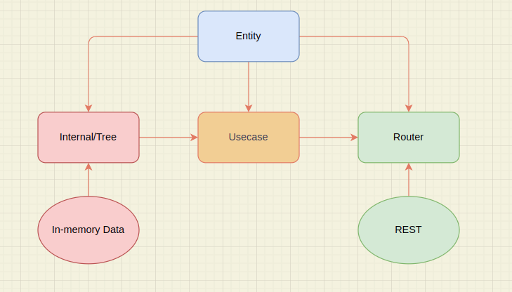
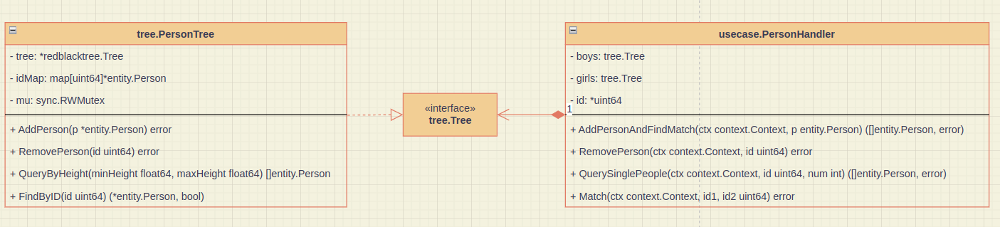

# Matching System

## Run this project
### Linux
```shell
# Build docker image
$ make docker-build

# Run docker
$ make docker-run

# Run unit test
$ make tests
```

## Structure
```shell
.
├── entity 
├── internal
│   └── tree  // 透過紅黑樹定義資料結構
├── router // API input/output
├── usecase // 商業邏輯
└── util
```


## Flow
[](https://mermaid.live/edit#pako:eNqVVd9v2jAQ_lcsP0xBom0Swg_lYVO1blKlderKXrayB-McidXEphdnLUP873PiUEyAdjMSZ993vst9d7bXlKsEaEwXuXriGUNNvl_NJDGjrOYpsmVGvlWAq6mQaQ63oJY5WLwej-L-4pYhK-Kdrh5LwFLJ_r7ysfZDZFXMAfeRi1-OS3_9MQP-QFKQCeDGQQJvCgx5RhYKyVytSrLvRrM8ByQ6Y9L8AUkF5j1nf-jur8Fyf3-ZKdSuAxPD3T_wvohSd4IuVVmKeQ6kYJpnkJjca446VvNVR4Fg6DDOLB2EyYQIk--zG0_dX9yBrlB22C1zwYGoRRvqOJeGvZm000dBzs7eG2aNuGE5NIuwxWrlZyi26qBVB-SdsbH7Blaorb-XzrhMkm1f1PW-lMlNTcLug9ir_bHTuQ3AfO9almA60Vo5jDDTAaoBGooNqRmINNOuSegd9GuH-iehM3Lse0zKpzuWBL0DYpkllvlWBFaEBzzdQaF-g0vVLg7-I0VdmtDfdrNmmMIRtjDwbOAjUPgqkU6KaFNEmyLaFPEwxU7h-f9cDG-lyn3PvRKcPHjQIk9ManP2EqahdPGwxQ_6hA9apKUAns3RdvHIuwKOUIDUJ70P19eLPZDMgasCiP_Bubf46GQd-PjNhubgeSbt3mFpuC0Nt6XhtjTcnlluzyyPrBga8QPKZj6yqrEV7e3RWHxVWxXt0wKwYCIxT8O6NplRcyEWMKOxmSYMH2Z0JjfGjlVaTVeS03jB8hL6FFWVZi-ralkTcyWYaZOio_2UCK3wRQnN8sa-R82z1KdLJmm8ps80Hp6PJtEgCiaTkT8xvxDOgqhPVzQejc_9oR8Oo2HgR-OJP9r06R-lTLSgcfCzmTdBNn8BVyfxdA)

## Note
### Data Structure

- tree.PersonTree
  - tree: 紅黑樹，key = 身高，value = 用戶ID slice
  - ipMap: map 儲存用戶 ID 對應用戶資料
  - mu: 讀寫鎖
- usecase.PersonHandler
  - boys: 管理男生的 tree
  - girls: 管理女生的 tree
  - id: 透過 atomic 操作累加用戶ID

## Time complexity
### AddSinglePersonAndMatch
1. GenerateNextID -> **O(1)**
2. (pt *PersonTree) AddPerson
   - `pt.mu.Lock()` 和 `pt.mu.Unlock()`：加鎖和解鎖操作是常數時間 -> **O(1)** 
   - 查找 `pt.idMap` 是否存在 ID -> **O(1)**
   - 插入到 `idMap` -> **O(1)**
   - 查找並更新 `pt.tree` -> **O(log n)**，n 為紅黑樹節點數量

整體為 **O(log n)**

### RemoveSinglePerson
1. findPerson -> **O(1)**
2. (pt *PersonTree) RemovePerson
    - `pt.mu.Lock()` 和 `pt.mu.Unlock()`：加鎖和解鎖操作是常數時間 -> **O(1)**
    - 查找 `pt.idMap` 是否存在 ID -> **O(1)**
    - 查找 `pt.tree` 中 `person.Height` -> **O(log n)**
    - 從 `ids` 列表中刪除 `id` -> **O(m)**，m 為 `ids`長度
    - `pt.tree` 更新
      - `ids` 為空，刪除紅黑樹節點 -> **O(log n)**
      - `ids` 不為空，更新節點 -> **O(log n)**

整體為 **O(log n + m)**

### Match
1. findPerson -> **O(1)**
2. Check Gender -> **O(1)**
3. Check Height -> **O(1)**
4. decrementWantedDate 是原子操作 -> **O(1)**
5. removeIfExhausted 檢查 `WantedDates` 是否為 0
   - (pt *PersonTree) RemovePerson -> **O(log n)**

整體為 **O(log n)**

### QuerySinglePeople
1. findPerson -> **O(1)**
2. (pt *PersonTree) QueryByHeight
   - get floor node -> **O(log n)**
   - 遍歷紅黑樹並檢查高度範圍 -> **O(k)**，k 為符合範圍的節點數
   - 從 `idMap` 查找 `id` 對應的 `Person` -> **O(m)**，m 為符合範圍的節點數

整體為 **O(log n + k + m)**

## API Documentation

### AddSinglePersonAndMatch
#### Endpoint:
`POST /addPersonAndFindMatch/`
#### Description:
此 API 用於添加一個新用戶並嘗試找到匹配對象。
#### Request:
- Method: POST  
- Content-Type: application/json  
- Body:
    ```json
    {
        "name": "3",        // 名字 (string)
        "height": 150,      // 身高 (float)
        "gender": "female", // 性別 (male 或 female) (string)
        "wantedDate": 1     // 想要的約會次數 (uint)
    }
    ```
#### Response:
- Success:
  - Status Code: 200 OK
    - Body:
    ```json
    {
        "meta": {
            "code": 1200,
            "message": ""
        },
        "data": [
            {
                "ID": 2,
                "Name": "3",
                "Height": 150,
                "Gender": "male",
                "WantedDates": 1
            }
        ]
    }
    ```     
- Error:
- Status Code: 400 Bad Request
Body:
json
複製程式碼
{
"error": "Error message"
}
```shell
curl 'http://localhost:8080/addPersonAndFindMatch/' \
--header 'Content-Type: application/json' \
--data '{
    "name": "3",
    "height": 150,
    "gender": "female",
    "wantedDate": 1
}'
```

### RemoveSinglePerson
```shell
curl --request DELETE 'http://localhost:8080/removeSinglePerson/{userID}/'
```
### QuerySinglePeople
```shell
curl 'http://localhost:8080/querySinglePeople/{userID}/?num={queryNumber}'
```
### Match
```shell
curl 'http://localhost:8080/match/' \
--header 'Content-Type: application/json' \
--data '{
    "id1": 1,
    "id2": 3
}'
```

## TBD
1. 儲存用戶可配對清單及選擇，需雙方都確認才成立配對。
2. 在紅黑樹實現較細粒度的鎖
3. 新增 token 機制識別用戶身份
4. 建立共用 map 同時管理 boys, girls ID 方便快速找到用戶